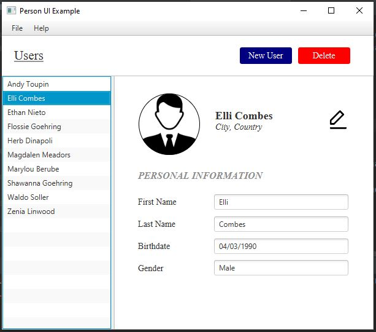
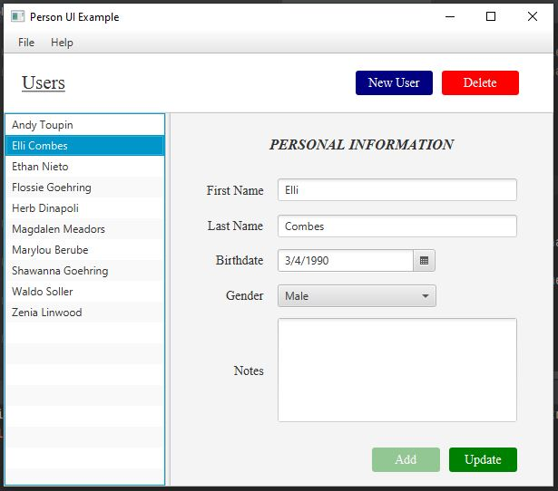
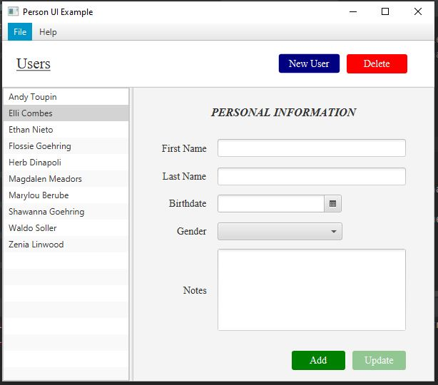

<h2> Person App - Basic Address book </h2> 

<h3> Description </h3>
Implemented using Scene builder and JavaFX. 

<h3> Features </h3>
<ol>
<li>MenuBar at the Top of the Window. Menue bar includes two menues: File and Help
The File menu includes the "Exit" menu-item which supports Ctrl+X KeyStroke combination
The Help menu includes the "About" menu-item which displays info about the implemented Software via a pop-up window. </li>
<li> Person Model which includes first name, last name, birth date, gender, and image. </li>
<li> Options to add, remove and/or update the contacts </li>
<li> View basic personal information in a seperate window. </li>
</ol>

<h3> Software </h3>
<h4>JavaFX SDK 11.0.2 -  https://openjfx.io/  
Scene Builder 11.0.0 - https://gluonhq.com/products/scene-builder/  
IntelliJ IDEA - https://www.jetbrains.com/idea/  
Instruction to set up - https://openjfx.io/openjfx/docs/#introduction   
For VM options: --module-path ${PATH_TO_JAVAFX} --add-modules javafx.controls,javafx.fxml ;${PATH_TO_JAVAFX} - path to JavaFX library </h4>

<h3> App Screenshots </h3>

#

#

#

